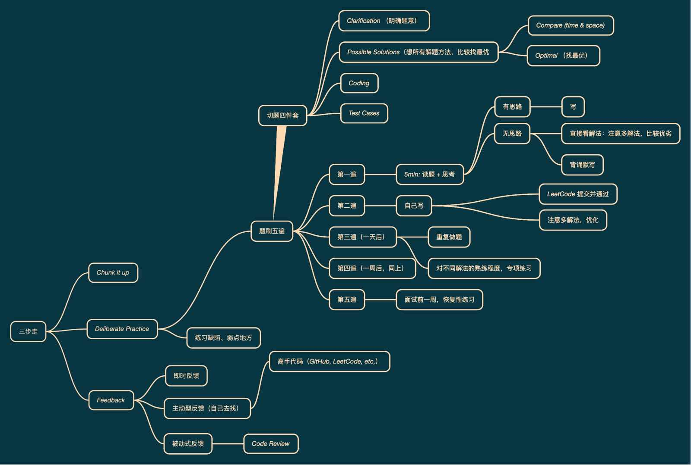

# 学习笔记


## Week1# 

### 数组 Array

**Java、C/C++ 实现**

```C
int arr[10];
```

**Python 实现**

```python
arr = []
arr = List()
```

**JavaScript 实现**

```javascript
let arr = [1,2,3]
```

##### 特点

- 数组的内存空间是连续的
- 数组可以随机的访问任何一个位置的元素，时间为常数 $O(1)$
- 插入元素（Insert）和删除元素（Delete）的时间是 $O(n)$
- 前增元素（prepend）和后增元素（append）时间为$O(1)$ 
  - 正常情况下的prepend操作时间应为$O(n)$，但是可以通过优化到$O(1)$：申请一个稍大的空间，在数组的最开始预留一部分空间，prepend操作则是把头下标前移一个位置即可

##### 参考链接

[Java 源码分析（ArrayList）](http://developer.classpath.org/doc/java/util/ArrayList-source.html)


### 链表 Linked List

**使用情况：**在需要频繁插入/删除元素时，数组并不适用，因此需要**链表（*Linked List*）**这个数据结构。

##### 结构

- 值 Value

- 指针 Next

```java
/* java 源码实现 */
class LinkedList {
  Node head; // head of first
  
  /* Linked List Node */
  class Node {
    int data;
    Node next;
    
    // Constructor to create a new node
    // Next is by default initialised as null
    Node(int d) { data = d; }
  }
}
```

一般头指针为 `head` 尾指针为`tail`


##### 双向链表

即有两个指针，分别指向前一个元素（Prev）和后一个元素（Next）

##### 循环链表

当`tail` 的 next 指针指向 `head` ，即 `tail.next == head` ，为循环链表

##### 操作

- **插入/删除：**时间为$O(1)$
- **前增/后增：**$O(1)$
- **查询：**$O(n)$

##### 参考链接

[Linked List 的标准实现代码](http://www.geeksforgeeks.org/implementing-a-linked-list-in-java-using-class/)

[Java 源码分析（LinkedList）](http://developer.classpath.org/doc/java/util/LinkedList-source.html)


### 跳表 Skip List

**跳表（Skip List）**是（只能）对**有序链表**进行的查询优化，对标的是平衡树（AVL Tree）和二分查找（Binary Search），1989年出现。其查询/插入/删除操作时间复杂度均为$O(\log n)$。优势：原理简单，容易实现，方便扩展，效率更高。因此在一些热门的项目里用来代替平衡树，如 Redis，LevelDB 等。

##### 一维的数据结构的加速通常采用升维的方式

思想：**空间换时间**

##### 添加索引


##### 时间复杂度分析

- 一级索引：$\dfrac{n}{2}$

- 二级索引：$\dfrac{n}{4}$

- $k$ 级索引：$\dfrac{n}{2^k}$
- 假设索引有 $h$ 级，最高级有2个结点，$\dfrac{n}{2^h} = 2$，从而求得 $h = \log 2n - 1$
- 即 $O(\log n)$
- 维护成本高，**空间复杂度**为 $O(n)$

##### 应用及参考链接

LRU Cache - Linked List：[LRU 缓存机制](http://leetcode-cn.com/problems/lru-cach)

Redis - Skip List：[跳跃表](http://redisbook.readthedocs.io/en/latest/internal-datastruct/skiplist.html)、[为啥 Redis 使用跳表（Skip List）而不是使用 Red-Black？](http://www.zhihu.com/question/20202931)


### 栈和队列 Stack and Queue

**栈（*stack*）**是**先入后出**结构（First In Last Out/ Last In First Out），**队列（*Queue*）**是**先入先出**结构（First In First Out）

##### 操作

- **查询：**$O(n)$
- **插入/删除：**$O(1)$

##### 栈的API（Java）

```java
Class Stack<E>
/* java 官方文档给出，工程中要使用栈，不推荐使用stack，而是用deque来实现栈 */
Deque<Integer> stack = new ArrayDeque<Integer>();

stack.empty();								// 返回值为 boolean，判断栈是否为空
stack.peek();									// E，返回栈顶元素的值（不删除栈定元素）
stack.pop();									// E，弹出并返回栈顶元素的值（会删除栈定元素）
stack.push(E item);						// E，向栈中压入元素
stack.search(Object o);				// int，查询并返回查询到的元素下标（位置）

```

##### 队列的API（Java）

```java
/* Queue并不是一个Class（类）而是一个Interface（接口） */
Interface Queue<E>

```

| Operation   | Throws exception（抛出异常） | Returns special value（返回特殊值） |
| ----------- | ---------------------------- | ----------------------------------- |
| **Insert**  | `add(e)`                     | `offer(e)`                          |
| **Remove**  | `remove()`                   | `poll()`                            |
| **Examine** | `element()`                  | `peek()`                            |

##### 参考链接

[Java 的 Stack 源码](http://developer.classpath.org/doc/java/util/Stack-source.html)

[Java 的 Queue 源码](http://fuseyism.com/classpath/doc/java/util/Queue-source.html)


### 双端队列 Deque (Double-End Queue)

**双端队列（*Deque*）**是两端可以进出的**Queue**

##### 操作

- **查询：**$O(n)$
- **插入/删除：**$O(1)$

##### 双端队列的API

```java
/* Deque也是一个Interface（接口） */
Interface Deque<E>
```


##### 与栈和队列的对比


##### 搜索文档方法

功能 语言 版本 e.g. `stack java 12`


### 优先级队列 Priority Queue

##### 操作

- **插入：**$O(1)$
- **取出：**$O(\log n)$ 按照元素优先级取出

##### 参考链接

[Java 的 PriorityQueue 文档](http://docs.oracle.com/javase/10/docs/api/java/util/PriorityQueue.html)

**python：**

[Python 的 heapq](http://docs.python.org/2/library/heapq.html)

[高性能的 container 库](http://docs.python.org/2/library/collections.html)


### 哈希表

**哈希表（*Hash Table*）**也叫**散列表**，是根据**关键码值（*Key Value*）**直接进行访问的结构，它通过把 Key Value 映射到表中的一个位置来访问记录，以加快查找速度，这样的一个函数叫做**散列函数（*Hash Function*）**，存放记录的数组则为哈希表

##### 实践

- 用户信息表
- 缓存（LRU Cache）
- 键值对存储（Redis）

##### 哈希碰撞（Hash Collision）

两个不同的元素映射到同一个位置，则为哈希碰撞


### 映射 Map 和 集合Set

##### Map

Key-Value对，Key不重复

```java
HashMap<Integer, Integer> map = new HashMap(Integer, Integer);		// 或用new TreeMap();

map.set(key, value);
map.get(key);
map.has(key);
map.size();
map.clear();
```

##### Set

不重复元素的集合，即Value不重复

```java
Set<Integer> set = new HashSet<Integer>();											// 或用new TreeSet();

set.add(value);
set.delet(value);
set.hash(value);
```

##### 参考链接

[Java Set 文档](http://docs.oracle.com/en/java/javase/12/docs/api/java.base/java/util/Set.html)

[Java Map 文档](http://docs.oracle.com/en/java/javase/12/docs/api/java.base/java/util/Map.html)


### 常用数据结构操作的复杂度表


----


# 第一周学习心得

我是在参加了7天体验营之后才下定决心报名训练营的，在7天的体验营以及衔接而来的第一周训练营内容，我觉得学习到的最重要的内容并不是数据结构的概念知识，而是超哥教的“五毒神掌”，“切题四件套” 以及如何通过搜索找到平时我们所需要的内容或遇到的困难的解决方案。根据学到的这些方法，我同时开启了LeetCode刷题的道路，曾经的我只会用暴力法解决2Sum题，而现在我也在慢慢地进步着，学习别人写的好的代码和思路。不得不说训练营的内容对小白来说真的是指路明灯，我现在刷题也逐渐上头，而且每当懒散的时候我都会去看大厂的招聘信息，看看自己是否能够符合意向岗位所要求的内容（不能），算是给自己一针又一针的鸡血，然后对自己说“滚去刷题/学习”。

希望我能在接下来的6周学习中坚持下去。

第一周刷题记录：31题，其中9题为上周的复刷。简单18/中等9/困难4

| 题目                        | 难度                           | 总次数 |
| --------------------------- | ------------------------------ | ------ |
| [1] 两数之和                | <font color=009A74>简单</font> | 3      |
| [11] 盛水最多的容器         | <font color=EF7C44>中等</font> | 3      |
| [15] 三数之和               | <font color=EF7C44>中等</font> | 2      |
| [20] 有效的括号             | <font color=009A74>简单</font> | 2      |
| [21] 合并两个有序链表       | <font color=009A74>简单</font> | 1      |
| [24] 两两交换链表中的节点   | <font color=EF7C44>中等</font> | 3      |
| [26] 删除排序数组中的重复项 | <font color=009A74>简单</font> | 3      |
| [35] 搜索插入位置           | <font color=009A74>简单</font> | 1      |
| [49] 字母异位词分组         | <font color=EF7C44>中等</font> | 1      |
| [66] 加一                   | <font color=009A74>简单</font> | 1      |
| [70] 爬楼梯                 | <font color=009A74>简单</font> | 2      |
| [84] 柱状图中最大的矩形     | <font color=EC4C46>困难</font> | 1      |
| [88] 合并两个有序数组       | <font color=009A74>简单</font> | 1      |
| [96] 不同的二叉搜索树       | <font color=EF7C44>中等</font> | 2      |
| [97] 交错字符串             | <font color=EC4C46>困难</font> | 1      |
| [98] 验证二叉搜索树         | <font color=EF7C44>中等</font> | 2      |
| [104] 二叉树的最大深度      | <font color=009A74>简单</font> | 3      |
| [111] 二叉树的最小深度      | <font color=009A74>简单</font> | 3      |
| [141] 三角形的最小路径和    | <font color=009A74>简单</font> | 2      |
| [120] 环形链表              | <font color=EF7C44>中等</font> | 3      |
| [155] 最小栈                | <font color=009A74>简单</font> | 2      |
| [189] 旋转数组              | <font color=009A74>简单</font> | 2      |
| [206] 旋转数组              | <font color=009A74>简单</font> | 1      |
| [239] 滑动窗口最大值        | <font color=EC4C46>困难</font> | 1      |
| [242] 有效的字母异位词      | <font color=009A74>简单</font> | 1      |
| [283] 移动零                | <font color=009A74>简单</font> | 2      |
| [312] 戳气球                | <font color=EC4C46>困难</font> | 1      |
| [350] 两个数组的交集 II     | <font color=009A74>简单</font> | 3      |
| [589] N叉树的前序遍历       | <font color=009A74>简单</font> | 3      |
| [641] 设计循环双端队列      | <font color=EF7C44>中等</font> | 1      |
| [758] 判断二分图            | <font color=EF7C44>中等</font> | 3      |

以及总结了超哥教的“**三步走**”的脑图




### 学习总结主题 #1 

**用 add first 或 add last 这套新的 API 改写 Deque 的代码。**

```java
Deque<String> deque = new LinkedList<String>();

deque.addFirst("a");
deque.addFirst("b");
deque.addFirst("c");
System.out.println(deque);

String str = deque.peekFirst();
System.out.println(str);
System.out.println(deque);

while (deque.size > 0) {
  System.out.println(deque.removeFirst());
}
System.out.println(deque);
```


### 学习总结主题 #2

**分析 Queue 和 Priority Queue 的源码。**