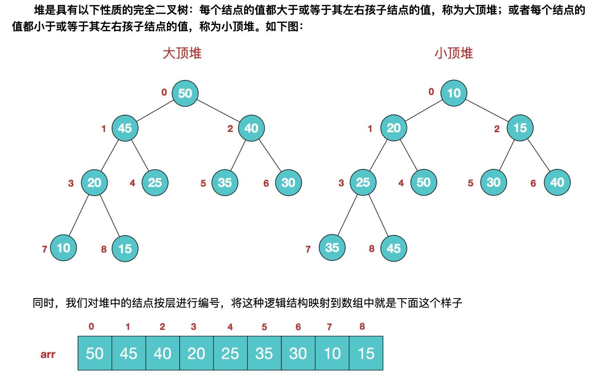
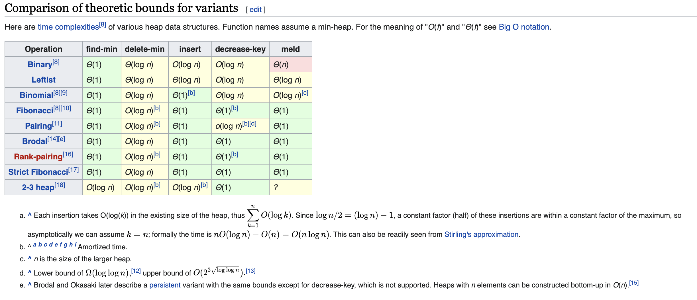
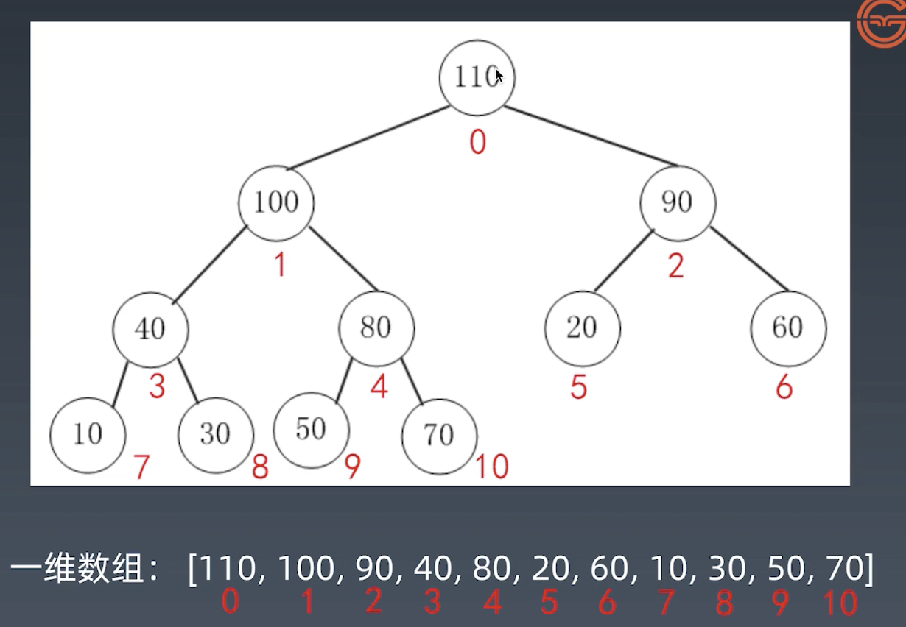

# 学习笔记

## Week2# 

### 树

当链表有多个`Next`指针，则为**树（*Tree*）**，即链表是特殊化的树。树是没有环的图（Graph），即树是特殊化的图


### 二叉树 Binary Tree

是每个节点最多只有两个分支（即不存在分支度大于2的节点）的树结构。通常分支被称作“**左子树**”或“**右子树**”。二叉树的分支具**有左右次序**，不能随意颠倒。

#### 示例代码

```Python
# Python
class TreeNode:
  def __init__(self, val):
    self.val = val
    self.left = None
    self.right = None
```

```C++
// C++
struct TreeNode {
  int val;
  TreeNode *left;
  TreeNode *right;
  TreeNode(int x): val(x), left(NULL), right(NULL) {}
}
```

```Java
// Java
public class TreeNode {
  public int val;
  public TreeNode left, right;
  public TreeNode(int val) {
    this.val = val;
    this.left = null;
    this.right = null;
  }
}
```

#### 遍历

##### 前序遍历  Pre-order

- **顺序**：根-左-右

- **代码**：

```Python
def preorder(self, root: TreeNode):
  if root:
    self.traverse_path.append(root.val)
    self.preorder(root.left)
    self.preorder(root.right)
```

##### 中序遍历 In-order

- **顺序**：左-根-右

- **代码**：

```Python
def inorder(self, root: TreeNode):
  if root:
    self.preorder(root.left)
    self.traverse_path.append(root.val)
    self.preorder(root.right)
```

##### 后序遍历 Post-order

- **顺序**：左-右-根

- **代码**：

```Python
def postorder(self, root: TreeNode):
  if root:
    self.preorder(root.left)
    self.preorder(root.right)
    self.traverse_path.append(root.val)
```


### 堆 Heap

可以迅速找到一堆数中的**最大值**或**最小值**的数据结构（不能同时找最大和最小）

- 根节点最大的堆叫做**大顶堆**或**大根堆**

- 根节点最小的对焦作**小顶堆**或**小根堆**



该数组从逻辑上讲就是一个堆结构，我们用简单的公式来描述一下堆的定义就是：

**大顶堆：arr[i] >= arr[2i+1] && arr[i] >= arr[2i+2]**  

**小顶堆：arr[i] <= arr[2i+1] && arr[i] <= arr[2i+2]**  


**大顶堆（小顶堆类似）的常见操作（API）**：

`find-max`			  	$O(1)$

`delete-maxt`	   	$O(\log N)$

`insert(create)`	$O(\log N)$ or $O(1)$


**不同实现的比较**




### 二叉堆 Binary Heap

通过**完全二叉树**来实现（实现较容易，但是性能表现一般）

**注：二叉堆是堆（优先队列 Priority Queue）的一种常见且简单的实现，单并不是最优的实现**

#### 性质

1. 是一颗完全树
2. 树中任意结点的值总是 $\geq$ 其子结点的值

#### 实现

1. 一般通过**数组**来实现

2. 假设第一个元素（根结点）在数组的索引为`0`，则父结点和子结点的位置关系如下：

   - 索引为 `i` 的左孩子的索引是 `(2*i+1)​`
   - 索引为 `i` 的右孩子的索引是 `(2*i+1)`
   - 索引为 `i​` 的父结点的索引是 `floor((i-1)/2)`

   

#### 操作

##### 插入 Insert 

时间复杂度： $O(\log N)$

1. 新元素一律先插入到堆尾
2. Heapifyup：依次向上调整整个堆堆结构（与父结点比较及交换，直到根）

```Java
// Java 部分代码
/**
	*	Insert new element into heap
	* Complexity: O(log N)
	* As worst case scenario, we need to traverse till the root
	*/
public void insert(int x) {
  if (isFull()) {
    throw new NoSuchElementException("Heap is full. No space to insert new element");
  }
  heap[heapSize++] = x;
  heapifyUp(heapsize - 1);
}

/**
	* Maintains the heap property while inserting an element
	*/
private void heapifyUp(int i) {
  int insertValue = heap[i];
  while (i > 0 && insertValue > head[parent(i)]) {
    heap[i] = heap[parent(i)];
    i = parent(i);
  }
  heap[i] = insertValue;
}
```

##### 删除 Delete

时间复杂度： $O(\log N)$

1. 将堆尾元素替换到顶部（即堆顶被替代删除）
2. HeapifyDown：依次从根向下调整整个堆堆结构（与左右孩子结点比较，与较大的子结点交换，直到叶子）

```Java
/**
	*	Delete element at index x
	* Complexity: O(log N)
	*/
public int delete(int x) {
  if (isEmpty()) {
    throw new NoSuchElementException("Heap is empty. No element to delete");
  }
  int key = heap[x];
  heap[x] = heap[heapSize - 1];
  heapSize--;
  heapifyDown(x);
  return key
}

/**
	* Maintains the heap property while deleting an element
	*/
private void heapifyDown(int i) {
  int child;
  int temp = heap[i];
  while (kthChild(i, 1) < heapSize) {
    child = maxChild(i);
    if (temp >= heap[child]){
      break;
    }
    heap[i] = heap[child];
    i = child;
  }
  heap[i] = temp;
}
```


### 堆排序 Heap Sort

**堆排序（*Heap Sort*）**是基于二叉堆数据结构的一种比较排序，它与**选择排序（*Selection Sort*）**相似，即找到最大值并将其置于末端。

##### 升序排列

1. 构建大顶堆
2. 此时大顶堆堆根结点为最大值，将其与堆的最后一个结点交换，将堆的大小减一（即将除最大值外的其他结点作为新的堆），将新堆重新堆化（Heapify）为大顶堆
3. 重复上述操作，最终可以得到一个升序数组

##### 降序排列

1. 构建小顶堆
2. 此时小顶堆堆根结点为最小值，将其与堆的最后一个结点交换，将堆的大小减一（即将除最小值外的其他结点作为新的堆），将新堆重新堆化（Heapify）为小顶堆
3. 重复上述操作，最终可以得到一个降序数组

##### 特点

1. 堆排序是原地算法（in-place algorithm）
2. 不稳定

##### 时间复杂度

堆化操作`heapify` 为 $O(\log N)$，创建堆的操作为 $O(N)$，堆排序的整体操作为 $O(N \log N)$

##### 代码实现

```Python
# Python program for implementation of heap Sort 

# To heapify subtree rooted at index i. 
# n is size of heap 
def heapify(arr, n, i): 
	largest = i # Initialize largest as root 
	l = 2 * i + 1	 # left = 2*i + 1 
	r = 2 * i + 2	 # right = 2*i + 2 

	# See if left child of root exists and is 
	# greater than root 
	if l < n and arr[i] < arr[l]: 
		largest = l 

	# See if right child of root exists and is 
	# greater than root 
	if r < n and arr[largest] < arr[r]: 
		largest = r 

	# Change root, if needed 
	if largest != i: 
		arr[i],arr[largest] = arr[largest],arr[i] # swap 

		# Heapify the root. 
		heapify(arr, n, largest) 

# The main function to sort an array of given size 
def heapSort(arr): 
	n = len(arr) 

	# Build a maxheap. 
	for i in range(n//2 - 1, -1, -1): 
		heapify(arr, n, i) 

	# One by one extract elements 
	for i in range(n-1, 0, -1): 
		arr[i], arr[0] = arr[0], arr[i] # swap 
		heapify(arr, i, 0) 

# Driver code to test above 
arr = [ 12, 11, 13, 5, 6, 7] 
heapSort(arr) 
n = len(arr) 
print ("Sorted array is") 
for i in range(n): 
	print ("%d" %arr[i]), 
# This code is contributed by Mohit Kumra 

```


### 图 Graph

#### 属性和分类

**图（*Graph*）**由**点（*Vertices*）**和**边（*Edges*）**组成。

##### 属性

- Graph $(V, E)$
- $V$ - vertex 点
  - 度（Degree）：入度/出度
  - 连通/非联通
- $E$ - Edge 边
  - 有向/无向
  - 权重

##### 图的表示

- 邻接矩阵（Adjacency Matrix）
- 邻接表（Adjacency List）

##### 图的分类

1. **无向无权图：**邻接矩阵是对称的，且值（权重）为0或1
2. **有向无权图：**邻接矩阵不对称，值（权重）为0或1。
3. **无向有权图：**邻接矩阵是对称的，值即权重
4. **有向有权图：**邻接矩阵不对称，值为权重

#### 图的算法

##### DFS

**代码：递归**

```Python
visited = set() 			 	# 和树中的DFS最大区别，因为树没有环路

def dfs(node, visited):
  if node in visited:  	# Terminator
    return							# Already visited
  visited.add(node)
  
  # Process current node here.
  
  for next_node in node.children():
    if not next_node in visited:
      dfs(next_node, visited)
```

##### BFS

**代码：**

```Python
def bfs(graph, start, end):
  queue = []
  queue.append([start])
  
  visited = set						# 和树中的DFS最大区别，因为树没有环路
  
  while queue:
    node = queue.pop()
    visited.add(node)
    
    process(node)
    nodes = generate_related_nodes(node)
    queue.push(nodes)
```

##### 高级算法

- [连通图个数](http://leetcode-cn.com/problems/number-of-islands/)
- [拓扑排序（Topological Sorting）](http://zhuanlan.zhihu.com/p/34871092)
- [最短路径（Shortest Path）：Dijkstra](http://www.bilibili.com/video/av25829980)
- [最小生成树（Minimum Spanning Tree）](http://www.bilibili.com/video/av84820276)（推荐B站：花花酱 的视频）


### 递归 Recursion

对于树来说，因为树的节点是以递归的方式来定义的，且具有重复性（自相似性），因此树的大部分算法都是可以用递归的

**递归（*Recursion*）**本质上是一种循环，是通过函数体（调用自身）来实现循环

##### 特点：

- 遇到递归调用时，向下进入下一层（一般会传入新参数）
- 当前层结束后，向上返回上一层，并继续运行
- 每一层的局部变量（传入的参数以外）都是一份拷贝，不会对回归过程产生影响

**示例：Factorial 阶乘实现**

```Python
def factorial(n):
    if n <= 1:
      return 1
  	return n * factorial(n-1)
```

##### 代码模版 Python

```Python
def recursion(level, param1, param2, ...):
    # Recursion terminator
    if level > MAX_LEVEL:
      precess_result
      return
    
    # Process logic in current level
    process(level, data, ...)
    
    # Drill down
    self.recursion(level+1, newparam, ...)
    
    # Reverse the current level status if needed
    
```

[其他语言版本](https://shimo.im/docs/EICAr9lRPUIPHxsH/read)

##### 思维要点

1. 不要人肉递归（最大误区）
2. 找最近重复子问题
3. 数学归纳法思维


----


## 第二周学习心得

第二周刷题记录：38次旧题+39道新题，一次周赛一次双周赛

这一周有两天产生了明显的疲惫感，懈怠了两天没怎么刷题，最后在周末又补了回来。这周尝试着参加了一次双周赛和周赛，表现一般，但是已经能够体现出来两周的训练成效了，要是两周前的我，可能连题都看不明白吧。周赛和双周赛的题目虽然难，大佬也特别多（太可怕了），但是同时好处就是能够学习到大佬们写的代码和思路（虽然可能要思考很久）。立个flag，以后双周赛都要参加！（因为在英国，周赛时间都是凌晨实在是熬不住）

继续坚持吧，为了不成为一个five


