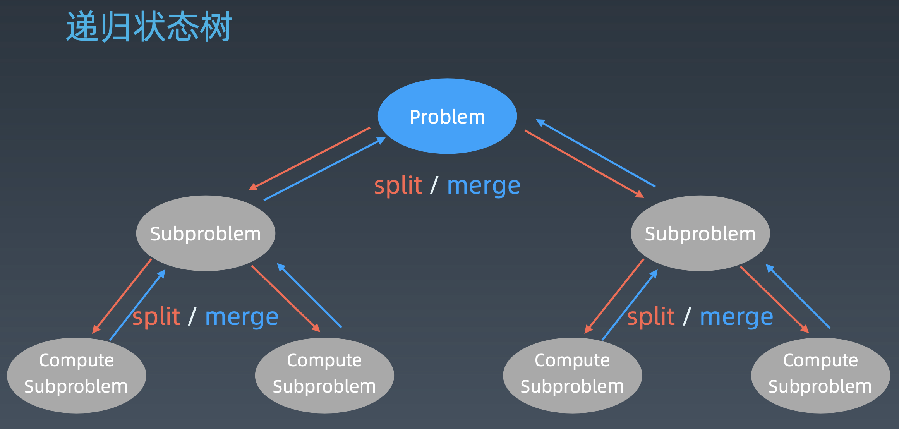

## Week 3# 学习笔记

### 分治和回溯 Divide & Conquer/ Backtracking

本质上是递归



#### 分治

##### 代码模版

```Python
# Python
def divide_conquer(problem, param1, param2, ...): 
  # recursion terminator 
  if problem is None: 
	print_result 
	return 

  # prepare data 
  data = prepare_data(problem) 
  subproblems = split_problem(problem, data) 

  # conquer subproblems 
  subresult1 = self.divide_conquer(subproblems[0], p1, ...) 
  subresult2 = self.divide_conquer(subproblems[1], p1, ...) 
  subresult3 = self.divide_conquer(subproblems[2], p1, ...) 
  …

  # process and generate the final result 
  result = process_result(subresult1, subresult2, subresult3, …)
	
  # revert the current level states
```

[其他语言版本代码版本](https://shimo.im/docs/zvlDqLLMFvcAF79A/)

#### 回溯 

采用**试错思想**，尝试**分步**地去解决一个问题。在分步解决问题的过程中，当它通过尝试发现现有的分步答案不能得到有效的正确的解答的时候，将取消上一步甚至上几步的计算，再通过其他的可能的分步解答再次尝试寻找问题的答案。

常采用最简单的递归方法实现，在反复重复上述步骤后可能出现：

- 找到一个可能存在的正确的答案
- 尝试了所有可能的分步方法后宣告该问题没有答案

最坏的情况下，回溯法会导致一次复杂度为指数时间的计算


### 深度优先搜索 DFS (Depth-First-Search)

##### 代码模版

```python
# 递归
visited = set() 

def dfs(node, visited):
    if node in visited: # terminator
    	# already visited 
    	return 

	visited.add(node) 

	# process current node here. 
	# ...
	for next_node in node.children(): 
		if next_node not in visited: 
			dfs(next_node, visited)


# 非递归 维护一个栈
def dfs(self, tree): 

	if tree.root is None: 
		return [] 

	visited, stack = [], [tree.root]

	while stack: 
		node = stack.pop() 
		visited.add(node)

		process(node) 
		nodes = generate_related_nodes(node) 
		stack.push(nodes) 

	# other processing work 
	# ...
```

[DFS 代码模板（递归写法、非递归写法）](https://shimo.im/docs/UdY2UUKtliYXmk8t/)


### 广度优先搜索 BFS (Breadth-First-Search )

##### 代码模版

```python
def bfs(graph, start, end):
    visited = set()
	queue = [] 
	queue.append([start]) 
	while queue: 
		node = queue.pop() 
		visited.add(node)
		process(node) 
		nodes = generate_related_nodes(node) 
		queue.push(nodes)
	# other processing work 
	...
```

[BFS 代码模板](https://shimo.im/docs/ZBghMEZWix0Lc2jQ/)


### 贪心算法 Greedy Algorithm

**贪心算法（*Greedy Algorithm*）**是一种在每一步选择中都采取在当前状态下最好或最优的选择，从而希望导致结果是**全局最好或最优**的算法。

**与动态规划不同的是**，它对每个子问题的解决方案都做出（最优）选择，**不能回退**。

动态规划则会保存以前的运算结果，并根据以前的结果对当前进行选择，能回退


贪心算法可以解决一些最优化问题，如：求图中的最小生成树、求哈夫曼编码等。但工程中一般不能得到全局最优的答案。

> 一旦一个问题可以用贪心算法来解决，那么贪心算法一般是解决这个问题的最好办法。由于贪心算法的高效性以及其所求得的答案比较接近最优结果，贪心算法也可以用作辅助算法或者直接解决一些要求结果不特别精确的问题。


##### 适合贪心算法的场景

问题能分解成子问题来解决，子问题的最优解能递推到最终问题的最优解。这种子问题最优解称为**最优子结构**


### 二分查找 Binary Search

##### 前提

1. 目标函数具有**单调性**
2. 存在**上下界**
3. 能够通过**索引访问**

##### 代码模版

```python
# Python
left, right = 0, len(array) - 1 
while left <= right: 
	  mid = (left + right) / 2 
	  if array[mid] == target: 
		    # find the target
		    break or return result 
	  elif array[mid] < target: 
		    left = mid + 1 
	  else: 
		    right = mid - 1
```

[二分查找其他语言代码模板](https://shimo.im/docs/xvIIfeEzWYEUdBPD/)

#### 牛顿迭代法

在迭代过程中，以**直线代替曲线**，用一阶泰勒展开式（即在当前点的切线）代替原曲线，求直线与 $x$ 轴的交点，重复这个过程直到收敛


## 学习总结

### 主题

使用二分查找，寻找一个半有序数组 `[4, 5, 6, 7, 0, 1, 2]` 中间无序的地方。

### 思路

假定数组为 `nums` ，先选定中间位置，观察中间位置 `mid` 的值与两端边界 `left = 0, right = nums.length - 1` 的值的大小关系，若数组为有序（且不重复）的，理论上应该是 `nums[left] < nums[mid] < nums[right]`。而当数组是半有序时，则必然存在 `nums[left] > nums[mid]` 或 `nums[right] < nums[mid]` 中的一种情形。可以使用暴力搜索或者二分查找。

我们假设找到无序部分后返回无序部分开始位置的下标值，若数组有序，则返回 `-1`

### 方法

#### I. 暴力

##### 算法

直接从 `i = 1` 开始向后遍历，判断 `nums[i-1] < nums[i]` 是否成立，若否，则返回当前 `i` 的值，即数组中无序部分开始的下标。若数组有序，则返回 `-1`

##### 代码

```python
class solution:
  	def findUnorderedIndex(self, nums: List[int]) -> int:
        for i in range(1, len(nums)):
          	if nums[i] < nums[i-1]:
              	return i
       	return -1
```

##### 复杂度分析

**时间复杂度：**$O(N)$ ，其中 $N$ 为数组长度

**空间复杂度：** $O(1)$，只使用了常数量的额外空间


#### II . 二分查找

##### 算法

1. 将 `left, right` 初始化指向数组 `nums` 的两端边界，找到中间位置 `mid` 
2. 判断中间位置的值 `nums[mid]` 与 `nums[left], nums[right]` 的大小关系，确定属于下面两种情形的哪一种：
   -  `nums[left] > nums[mid]`  `mid` 在无序部分中
     - 更新 `right = mid ` 
   -  `nums[right] < nums[mid]` 无序部分在 `mid` 的右方且不包括 `mid`
     - 更新 `left = mid + 1`
   - 若不属于两种情形中的任意一种，则数组有序，返回 `-1`
3. 当 `left < right` 时，继续循环第 2 步
4. 循环结束，返回 `left` 

##### 代码

```python
class solution:
  	def findUnorderedIndex(self, nums: List[int]) -> int:
      	left, right = 0, len(nums) - 1
        mid = left + (right - left) // 2
        while left < right:
          	if nums[left] > nums[mid]:
              	right = mid
            elif nums[right] < nums[mid]:
              	left = mid + 1
            else:
              	return -1
              
        return left
```

##### 复杂度分析

**时间复杂度：**$O(\log N)$ ，其中 $N$ 为数组长度

**空间复杂度：** $O(1)$，只使用了常数量的额外空间

